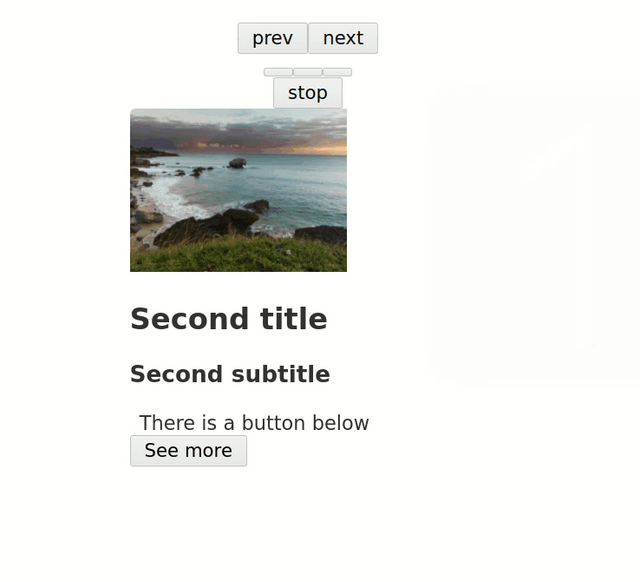

# tinyslider 

[CAREFUL - WORK IN PROGRESS]

`tinyslider` is an R package that allows to create a carousel via the JavaScript library [tiny-slider](https://github.com/ganlanyuan/tiny-slider). It doesn't have any Javascript dependencies so there shouldn't be conflicts with other htmlwidgets.

You can install this package with:

```r
# install.packages("devtools")
devtools::install_github("etiennebacher/tinyslider")
```

See [here](https://tinyslider.etiennebacher.com/#/) for the documentation.

## Demo

This is a small demo to create a standalone widget:

```
library(tinyslider)

tinyslider(
  elementId = "test",
  tinyslider_card(
    title = "First title",
    subtitle = "First subtitle",
    content = paste0(
      "Lorem Ipsum is simply dummy text of",
      "the printing and typesetting industry. Lorem Ipsum has been the",
      "industry's standard dummy text ever since the 1500s,",
      "when an unknown printer took a galley of type and scrambled",
      "it to make a type specimen book."
    ),
    image = "https://placeimg.com/200/150/nature"
  ),
  tinyslider_card(
    "Second title",
    "Second subtitle",
    "There is a button below",
    button_text = "See more",
    image = "https://placeimg.com/200/150/nature/2"
  ),
  tinyslider_card(
    "Third title",
    subtitle = NULL,
    content = paste0(
      "Lorem Ipsum is simply dummy text of",
      "the printing and typesetting industry. Lorem Ipsum has been",
      "the industry's standard dummy text ever since the 1500s,",
      "when an unknown printer took a galley of type and",
      "scrambled it to make a type specimen book. It has",
      "survived not only five centuries, but also the leap into",
      "electronic typesetting, remaining essentially unchanged.",
      "It was popularised in the 1960s with the",
      "release of Letraset sheets containing Lorem Ipsum passages,",
      "and more recently with desktop publishing",
      "software like Aldus PageMaker including versions of Lorem Ipsum."
    )
  ),
  options = list(
    loop = TRUE,
    autoplay = TRUE,
    autoplayTimeout = 1000
  )
)
```



## Code of Conduct
  
Please note that the tinyslider project is released with a [Contributor Code of Conduct](https://contributor-covenant.org/version/2/0/CODE_OF_CONDUCT.html). By contributing to this project, you agree to abide by its terms.
